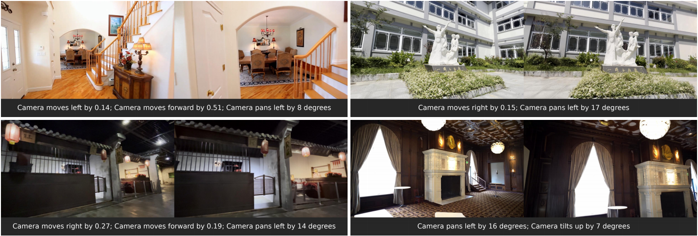

<h1 align="center">UniGeo</h2>
<p align="center">
<a href="https://openreview.net/profile?id=~Hong_Jiang4"><strong>Hong Jiang</strong></a>
·
<a href="https://song-wensong.github.io/"><strong>Wensong Song</strong></a>
·
<a href="https://z-x-yang.github.io/"><strong>Zongxing Yang</strong></a>
·
<a href="https://scholar.google.com/citations?user=WKLRPsAAAAAJ&hl=en"><strong>Ruijie Quan</strong></a>
·
<a href="https://scholar.google.com/citations?user=RMSuNFwAAAAJ&hl=en"><strong>Yi Yang</strong></a>
<br>
<br>
    <a href="https://arxiv.org/pdf/2604.17565"></a>
    <a href='https://mo230761.github.io/UniGeo.github.io/'></a>
    <a href='https://huggingface.co/123123aa123/UniGeo'></a>
<br>
<b>Zhejiang University &nbsp; | &nbsp; Harvard University &nbsp;  </b>
</p>

## 🔥 News


* **[2026.4.24]** Release inference demo and pretrained [checkpoint]((https://huggingface.co/123123aa123/UniGeo)).


## 💡 Demo



The parameters in our examples are normalized to a unified scale via VGGT. For more demos and detailed examples, check out our project page:  <a href='https://mo230761.github.io/UniGeo.github.io/'></a>

## 🛠️ Installation

Begin by cloning the repository:

```bash
git clone https://github.com/mo230761/UniGeo
cd UniGeo
```

### Installation Guide for Linux

Conda's installation instructions are available [here](https://docs.anaconda.com/free/miniconda/index.html).

```shell
conda create -n unigeo python==3.9

conda activate unigeo

pip install -r requirements.txt
```
#### 📦 Install PyTorch3D (Required)
This project strictly requires `pytorch3d`, which **must** be installed via a conda package. 

> **⚠️ CRITICAL Note:** The exact PyTorch3D package you need depends on your local Python, CUDA, and PyTorch versions. **DO NOT** just copy the command below blindly. You must find and use the specific package that matches your environment.

**Example Installation:**
If your environment is Python 3.9, CUDA 12.1, and PyTorch 2.4.1, your installation command would look like this:

```bash
# Please replace the .tar.bz2 file with the one matching your specific environment!
conda install /path/to/your/download/pytorch3d-0.7.8-py39_cu121_pyt241.tar.bz2
```

## ⏬ Download Checkpoints

*   **UniGeo Lora:** Download the main checkpoint from [HuggingFace](https://huggingface.co/123123aa123/UniGeo). This checkpoint is optimized for real-world images. Since real-world images often feature highly complex compositions and diverse scene layouts, we disabled the Geometric Anchor Attention to avoid over-constraining the generation.

*   **Wan and VGGT Model:** This project relies on [
Wan2.2-TI2V-5B](https://huggingface.co/Wan-AI/Wan2.2-TI2V-5B) and [
VGGT-1B](https://huggingface.co/facebook/VGGT-1B). Download its checkpoint(s) as well.


## 🎥 Inference

> **💡 Quick Start:** We have provided an example dataset in the `example_dataset/` folder. You can directly use it!

To run inference on your images, please follow this step-by-step pipeline:

**Step 1: Data Preparation**

Organize your images and the corresponding `prompt.json` directly into a dataset folder :

```text
/path/to/dataset/
├── image1.png
├── image2.png
├── ...
└── prompt.json
```

The `prompt.json` should map each image filename to its corresponding camera motion prompt. 

Example:
```json
{
  "image1.png": "Camera pans left by 16 degrees; Camera tilts up by 7 degrees",
  "image2.png": "Camera moves forward by 2.5 meters"
}
```

**Step 2: Generate Point Clouds**

Before running the main generation, translate your prompts into point clouds :


```bash
cd vggt
python Prompt_to_Point_Cloud.py \
    --model_path /path/to/VGGT \
    --dataset_path /path/to/dataset
```

**Step 3: Final Generation**

Once the point clouds are ready, run the core inference pipeline to generate the final camera-controllable results :

```bash
cd ../DiffSynth-Studio
python infer.py \
    --dataset_path /path/to/dataset (point cloud already included) \
    --wan_model_dir /path/to/Wan2.2-TI2V-5B \
    --lora_path /path/to/lora \
    --wan_config_path /path/to/config.json (see `my_config.json` in this repo)
```


## 🤝 Acknowledgement

We appreciate the open source of the following projects:

* [Diffusers](https://github.com/huggingface/diffusers)
* [Wan](https://github.com/Wan-Video/Wan2.2)
* [VGGT](https://github.com/facebookresearch/vggt)

## Citation
```
@misc{jiang2026unigeounifyinggeometricguidance,
      title={UniGeo: Unifying Geometric Guidance for Camera-Controllable Image Editing via Video Models}, 
      author={Hong Jiang and Wensong Song and Zongxing Yang and Ruijie Quan and Yi Yang},
      year={2026},
      eprint={2604.17565},
      archivePrefix={arXiv},
      primaryClass={cs.CV},
      url={https://arxiv.org/abs/2604.17565}, 
}
```
